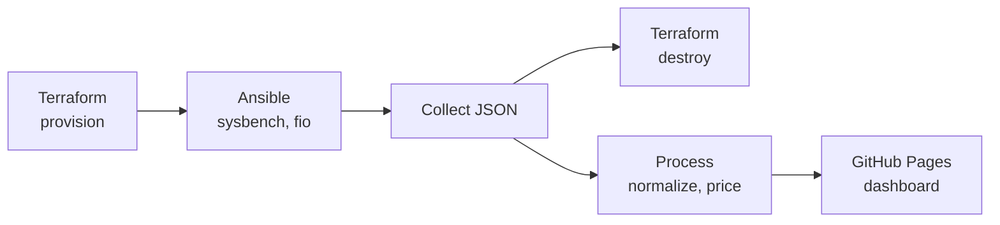

# Cloud Bench

[](https://github.com/fabianwimberger/cloud-bench/actions)
[](https://codecov.io/gh/fabianwimberger/cloud-bench)
[](https://opensource.org/licenses/MIT)

A cloud instance benchmarking suite comparing CPU, memory, and disk performance across providers with cost analysis. 31 instance types across Hetzner Cloud, AWS EC2, OVHcloud, Oracle Cloud (OCI), Google Cloud Platform (GCP), and Microsoft Azure.

## Background

A €20 instance can mean very different things between providers. This runs the same sysbench and fio suite on each, tracks cost per benchmark point, and publishes the results to GitHub Pages. Infrastructure is provisioned and torn down via Terraform and Ansible so runs stay reproducible.

## Features

- **Multi-provider** — Hetzner Cloud, AWS EC2, OVHcloud, OCI, GCP, Azure (31 instance types)
- **Standardized benchmarks** — CPU (sysbench), Memory (sysbench), Disk I/O (fio)
- **Metric averaging** — scores based on all historical runs, not just the latest
- **Cost analysis** — performance per dollar with EUR/USD toggle
- **Interactive dashboard** — filtering, comparison, per-instance history charts
- **Automated pricing** — live pricing from provider APIs + ECB exchange rates
- **Security-first** — fresh SSH keys per run, firewall whitelisting, automatic cleanup
- **Cost guards** — pre-run estimation blocks expensive configurations ($5 / 15 instance limit)
- **Local benchmarking** — standalone script for users to compare their own hardware

## Live Dashboard

View the latest results at **[fabianwimberger.github.io/cloud-bench](https://fabianwimberger.github.io/cloud-bench/)**

Scores shown are averaged across all benchmark runs for each instance type, not just the latest run.

## Pipeline



## Quick Start

### Local

Compare your own machine against the official results. No cloud credentials needed:

```bash
git clone https://github.com/fabianwimberger/cloud-bench.git
cd cloud-bench
sudo bash scripts/run-local-bench.sh
```

Runs the same sysbench/fio benchmarks and outputs a JSON file plus a terminal summary. See [docs/local-benchmark.md](docs/local-benchmark.md) for details.

### Cloud

```bash
# Clone and configure
git clone https://github.com/fabianwimberger/cloud-bench.git
cd cloud-bench

# Hetzner Cloud
export HCLOUD_TOKEN="your-token"
./scripts/run-local.sh

# AWS
export AWS_ACCESS_KEY_ID="your-key"
export AWS_SECRET_ACCESS_KEY="your-secret"
PROVIDER=aws ./scripts/run-local.sh

# OVHcloud
export OVH_OPENSTACK_USERNAME="user-xxxxx"
export OVH_OPENSTACK_PASSWORD="your-password"
export OVH_CLOUD_PROJECT_ID="your-project-id"
PROVIDER=ovhcloud ./scripts/run-local.sh

# GCP
export GCP_PROJECT_ID="your-project-id"
export GCP_CREDENTIALS='{"type": "service_account", ...}'  # Service account JSON key
PROVIDER=gcp ./scripts/run-local.sh

# Azure
export AZURE_SUBSCRIPTION_ID="your-subscription-id"
export AZURE_CLIENT_ID="your-client-id"
export AZURE_CLIENT_SECRET="your-client-secret"
export AZURE_TENANT_ID="your-tenant-id"
PROVIDER=azure ./scripts/run-local.sh

# Or run via GitHub Actions: Actions > Run Benchmarks
```

## How It Works

```
config/instances.yaml → Terraform → Ansible (sysbench/fio) → Python (scoring) → React Dashboard
```

**Methodology:**
- 5 runs per test, median value used for consistency
- Scores normalized 0-100 per category
- Weights: CPU 40%, Memory 35%, Disk 25%
- Raw metrics averaged across all historical runs per instance
- Cost-efficiency calculated from monthly price and composite score
- All benchmarks run on Ubuntu 24.04 in EU (Frankfurt) regions

## Configuration

Edit `config/instances.yaml` to add/remove instances:

```yaml
providers:
  hetzner:
    currency: EUR
    default_region: fsn1
    instances:
      - id: cx23
        name: CX23
        arch: X86
        vcpu: 2
        ram_gb: 4
        disk_gb: 40
        pricing:
          hourly: 0.0048
          monthly: 2.99
```

No code changes needed — Terraform, Ansible, and the frontend all pick up config changes automatically. See [docs/configuration.md](docs/configuration.md) for details.

## Security

- Fresh Ed25519 SSH key generated per run, never reused
- Firewall/security group allows SSH from runner IP only
- Auto-cleanup via `if: always()` — infrastructure destroyed even if benchmarks fail
- Orphan cleanup workflows as safety net (manual trigger for all providers)

## Documentation

- [Setup Guide](docs/setup-guide.md) — credentials and first run
- [Configuration](docs/configuration.md) — instances, regions, providers
- [Architecture](docs/architecture.md) — system design and scoring
- [Data Format](docs/data-format.md) — JSON schemas
- [Cost Analysis](docs/cost-analysis.md) — per-run costs and safety nets
- [Runbook](docs/runbook.md) — troubleshooting
- [Local Benchmark](docs/local-benchmark.md) — run benchmarks on your own machine

## License

MIT License — see [LICENSE](LICENSE) file.

### Third-Party Licenses

| Component | License | Source |
|-----------|---------|--------|
| sysbench | [GPL v2+](https://github.com/akopytov/sysbench/blob/master/COPYING) | https://github.com/akopytov/sysbench |
| fio | [GPL v2](https://github.com/axboe/fio/blob/master/COPYING) | https://github.com/axboe/fio |
